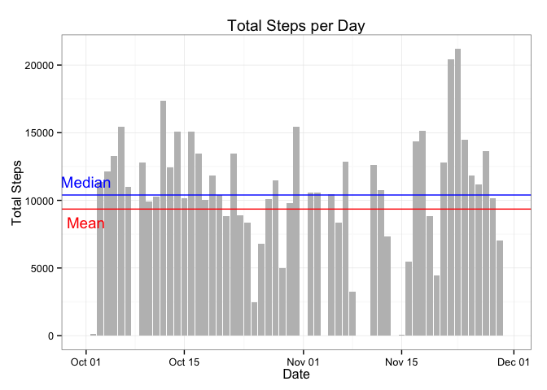
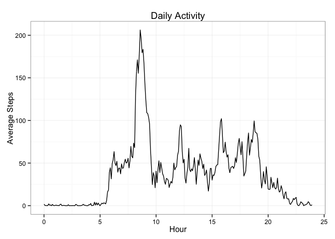
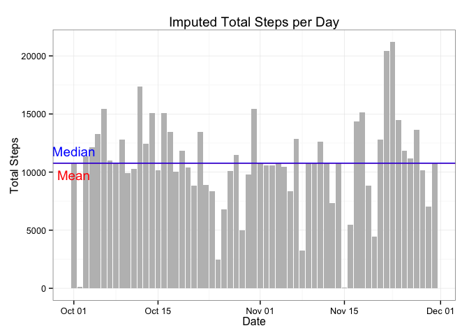
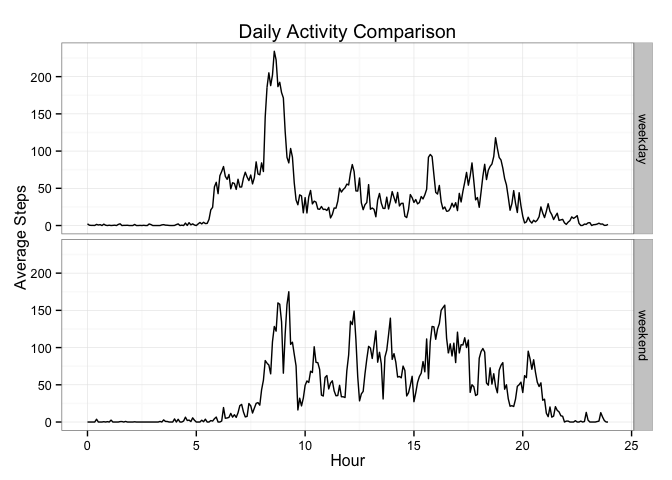

# Reproducible Research: Peer Assessment 1
Peter W Setter  
### Introduction
From the assignment description:

>It is now possible to collect a large amount of data about personal movement using activity monitoring devices such as a Fitbit, Nike Fuelband, or Jawbone Up. These type of devices are part of the “quantified self” movement – a group of enthusiasts who take measurements about themselves regularly to improve their health, to find patterns in their behavior, or because they are tech geeks. But these data remain under-utilized both because the raw data are hard to obtain and there is a lack of statistical methods and software for processing and interpreting the data.

In this assignment, we will perform a simple analysis on one individual's walking activity. Walking activity was recorded as the number of steps taken during a 5-minute interval during the day.

### Loading packages
We start by loading the packages we'll need to perform our analysis.

```r
library(dplyr)
```

```
## 
## Attaching package: 'dplyr'
## 
## The following object is masked from 'package:stats':
## 
##     filter
## 
## The following objects are masked from 'package:base':
## 
##     intersect, setdiff, setequal, union
```

```r
library(lubridate)
library(ggplot2)
```

### Loading and preprocessing the data
We start by unzipping the file. In one line, we read the unzipped flat file and convert the resulting dataframe into a dplyr data frame tbl.

```r
unzip("activity.zip")
activity.data <- tbl_df(read.csv("activity.csv", header=TRUE))
```

Before starting the analysis, we check the structure of each column.

```r
str(activity.data)
```

```
## Classes 'tbl_df', 'tbl' and 'data.frame':	17568 obs. of  3 variables:
##  $ steps   : int  NA NA NA NA NA NA NA NA NA NA ...
##  $ date    : Factor w/ 61 levels "2012-10-01","2012-10-02",..: 1 1 1 1 1 1 1 1 1 1 ...
##  $ interval: int  0 5 10 15 20 25 30 35 40 45 ...
```

We note that there are a number of missing values. (Coded as `NA`.)

The date column is a factor, so we convert it to a POSIXct date.

```r
activity.data$date <- ymd(activity.data$date)
```

The biggest challenge of the data set is the `interval` column. Close examination shows that it reports the time using the 24-hour convention, with leading zeros removed. For example, the value in the first row is 0, which corresponds to 00:00. The value in the second row is 5, which corresponds to 00:05. 

`Interval` was used to create `hour` via the `mutate` function. Each value was integer divided by 100 to produce the hour, which was added to the remainder divided by 60.  

Later, in the analysis, we will compare the number of steps taken on particular days of the week, so we create a new column called `daytype` using `mutate` and `wday`. `daytype` codes each date as either `weekend` or `weekday`.

These mutations are performed and the columns of interest are selected to create a new data frame tbl called `activity.data2`.


```r
activity.data2 <- activity.data %>%
        mutate(hour = interval %/% 100 + (interval %% 100)/60) %>%        
        mutate(daytype = as.factor(ifelse(wday(date) %in% c(1,7), "weekend", "weekday"))) %>%
        select(steps, date, hour, daytype)
```


### What is mean and median total number of steps taken per day?
To begin our analysis, we determine the total number of steps taken per day. We'll use dplyr to create a new data frame tbl with this aggregation.

```r
daily.totals <- activity.data2 %>%
                        group_by(date) %>%
                        summarise(total.steps = sum(steps, na.rm=TRUE))
```

We're interested in determining the mean and median steps per day.

```r
mean.steps <- mean(daily.totals$total.steps)
median.steps <- median(daily.totals$total.steps)
```

The mean is 9354.2295082 steps per day and the median is 10395 steps per day.

We'll create a histogram summarizing the data, including the mean and median values.

```r
ggplot(daily.totals, aes(date, total.steps)) + 
        geom_histogram(stat="identity", fill='grey') +
        geom_hline(yintercept=mean.steps, color='red') +
        geom_hline(yintercept=median.steps, color='blue') +
        labs(title="Total Steps per Day", x="Date", y='Total Steps') +
        annotate("text", x=ymd('2012-10-01'), y=mean.steps-1000, 
                 color='red', label = "Mean") +
        annotate("text", x=ymd('2012-10-01'), y=median.steps+1000, 
                 color='blue', label="Median") +
        theme_bw()      
```

 

The histogram shows that there is considerable variation between days. In addition, there appears to be several days when no data was collected.

### What is the average daily activity pattern?
We next turn our attention to the daily activity pattern, that is, the average number of steps taken during each time interval. We'll calculate and store these values in a new data frame tbl called `daily.activity`.


```r
daily.activity <- activity.data2 %>%
                        group_by(hour) %>%
                        summarise(avg.steps = mean(steps, na.rm=TRUE))
```

We'll visualize the daily activity averages and determine which interval has the highest average number of steps.


```r
ggplot(daily.activity, aes(hour, avg.steps)) +
        geom_line() +
        labs(title="Daily Activity", x="Hour", y='Average Steps') +
        theme_bw()
```

 

```r
max.interval <- as.numeric(daily.activity[which.max(daily.activity$avg.steps),1])
```

Based on the results, the interval with the highest average steps is 8.5833333.

Examining the graph, there is little activity between time intervals 0 and 500. The intervals around 8.5833333 are a peak in activity.

### Imputing missing values
We saw earlier that the data set contains `NA` values, which will affect our median and mean data. We will first determine the number of `NA` values, then impute the values using our averages from `daily.activity`.


```r
total.na <- sum(is.na(activity.data2$steps))
total.obs <- nrow(activity.data2)
percent.na <- round(total.na/total.obs * 100)
```

Of the 17568 intervals, there were 2304 `NA` values or 13%.

We'll now create a completed data set, called `imputed.data`, which replaces `NA` values based by the average number of steps for that interval found in `daily.activity`.


```r
imputed.data <- activity.data2
for(row in 1:nrow(imputed.data)) {
        if(is.na(imputed.data[row,1])) {
                int <- as.numeric(imputed.data[row, 3])
                imputed.data[row,1] <- daily.activity[daily.activity$hour == int,2]
        }
}
```

As we did before, we'll create a data frame tbl with the totals for each day, then calculate the mean and median values. In addition, we'll compare the imputed mean and median with the mean and median from the original data set. 


```r
imputed.totals <- imputed.data %>%
                        group_by(date) %>%
                        summarise(total.steps = sum(steps, na.rm=TRUE))
imputed.mean <- mean(imputed.totals$total.steps)
imputed.median <- median(imputed.totals$total.steps)

diff.means <- imputed.mean - mean.steps
diff.median <- imputed.median - median.steps
```

The mean is 1.0766189\times 10^{4} steps per day and the median is 1.0766189\times 10^{4} steps per day, which are 1411.959171 steps and 371.1886792 steps greater than we calculated for the original data set.

We'll create a histogram summarizing the imputed data, including the mean and median values.

```r
ggplot(imputed.totals, aes(date, total.steps)) + 
        geom_histogram(stat="identity", fill='grey') +
        geom_hline(yintercept=imputed.mean, color='red') +
        geom_hline(yintercept=imputed.median, color='blue') +
        labs(title="Imputed Total Steps per Day", x="Date", y='Total Steps') +
        annotate("text", x=ymd('2012-10-01'), y=imputed.mean-1000, 
                 color='red', label = "Mean") +
        annotate("text", x=ymd('2012-10-01'), y=imputed.median+1000, 
                 color='blue', label="Median") +
        theme_bw() 
```

 

Interestingly, with the imputed values, there appears to be two days with nearly no activity. 

### Are there differences in activity patterns between weekdays and weekends?
The final step of the analysis will be to compare the average steps taken during weekdays and weekends. We start by creating a new data frame tbl that seprates weekdays and weekends. We then graph the data with a panel for each part of the week.


```r
daytype.activity <- activity.data2 %>%
                        group_by(hour, daytype) %>%
                        summarize(avg.steps = mean(steps, na.rm=TRUE))

ggplot(daytype.activity, aes(x=hour, y=avg.steps)) +
        geom_line() +
        facet_grid(daytype ~ .) +
        labs(title="Daily Activity Comparison", x="Hour", y='Average Steps') +
        theme_bw()
```

 

On weekends, activity starts later in the day, but the peak activity remains around 8.5833333. Compared to weekdays, there appears to be more activity on the weekends.
